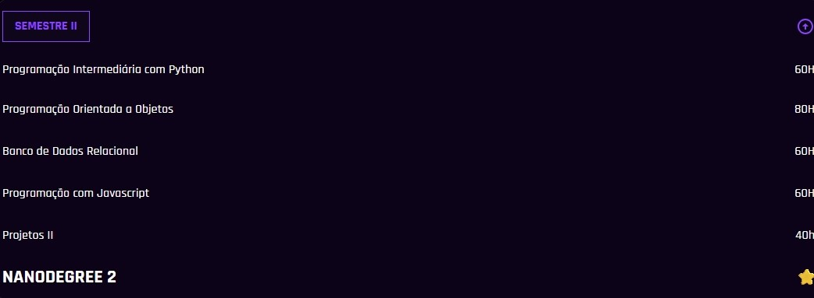
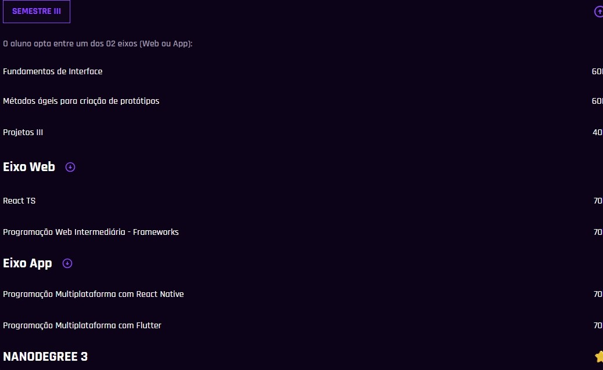
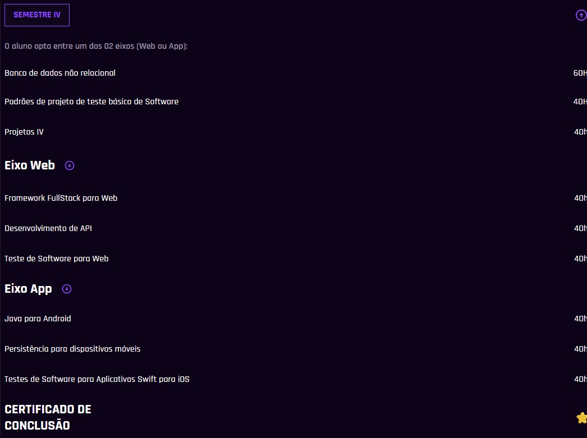

#  Projeto Desenvolve
### Curso De Desenvolvimento Full Stack.

#### Grade curricular:

  
  
  
  
  
  #### Duração: 1200 horas.
  
  <a href="https://projetodesenvolve.com.br/itabira" target="_blank">Link do Curso</a>

